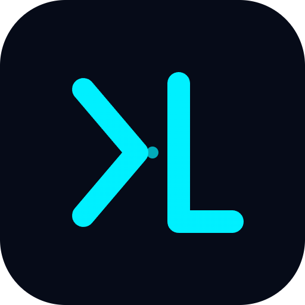

<div align="center">
  

# xiliuAUTO

### AI 驱动的自动化漏洞挖掘与安全运营平台

`多 Agent 协同 · 24×7 无人值守 · 智能工具编排 · 知识沉淀复用`

[](https://www.python.org/)
[](https://vuejs.org/)
[](https://www.docker.com/)
[](LICENSE)

**一台机器 = 7×24 小时不歇的安全运营中枢。AI 自主侦察挖洞，人工只做复审决策。**

</div>

---

## 概述

**xiliuAUTO** 是一个自研的 AI 原生安全运营平台，将多 Agent 协同编排、自动化漏洞挖掘、智能工具调度、RAG 知识复用和安全治理整合在单一可审计工作空间中。

系统采用自研的多 Agent 编排引擎，将自然语言意图转化为受控、可审计的安全行动。Worker Agent 通过 LLM function calling 自主调度 30+ 内置安全工具进行真实攻击面验证，Reviewer Agent 进行极理性 AI 初审过滤误报，通杀 Hunter 自动分析漏洞通用性并批量验证同款站点。

### 核心架构

```
┌─────────────────────────────────────────────────────────────┐
│                        Web UI (Vue 3)                         │
│  任务 │ 资产 │ 漏洞看板 │ 审批 │ 审计 │ 用户 │ 通知 │ 设置  │
├─────────────────────────────────────────────────────────────┤
│                    API Gateway (FastAPI)                     │
│           RBAC │ 审计日志 │ WAF │ HITL 审批 │ 速率限制       │
├─────────────────────────────────────────────────────────────┤
│  ┌──────────────┐  ┌───────────────┐  ┌──────────────────┐ │
│  │  Collector    │  │   Worker       │  │   Reviewer       │ │
│  │  Agent        │  │   Agent        │  │   Agent          │ │
│  │               │  │                │  │                  │ │
│  │ FOFA/Quake/   │  │ LLM + 工具链   │  │ AI 初审          │ │
│  │ Shodan/Hunter │  │ (内置+扩展)    │  │ + HITL 审批      │ │
│  │ +自然语言意图 │  │                │  │                  │ │
│  └──────┬────────┘  └───────┬────────┘  └────────┬─────────┘ │
│  ┌──────┴───────────────────┴────────────────────┴─────────┐ │
│  │              工具执行层                                    │ │
│  │  内置工具 │ MCP 扩展工具 │ RAG 知识库 │ 通知系统           │ │
│  │  nmap    │ subfinder  │ ChromaDB  │ Webhook/钉钉/企微    │ │
│  │  nuclei  │ ffuf/gobuster│ 向量检索 │ 飞书/Telegram        │ │
│  │  sqlmap  │ nikto/dalfox│ 情报沉淀  │ 出洞告警             │ │
│  └──────────────────────────────────────────────────────────┘ │
│  ┌──────────────────────────────────────────────────────────┐ │
│  │              编排层                                       │ │
│  │  24×7 调度器 │ 通杀Hunter │ 扩大危害 │ 攻击链 │ 崩溃恢复 │ │
│  └──────────────────────────────────────────────────────────┘ │
│  ┌──────────────────────────────────────────────────────────┐ │
│  │              数据层                                       │ │
│  │  SQLite │ ChromaDB(向量) │ 文件存储 │ 审计日志 │ 资产/漏洞 │ │
│  └──────────────────────────────────────────────────────────┘ │
└─────────────────────────────────────────────────────────────┘
```

---

## 核心特性

### 智能体与编排

| 特性 | 说明 |
|------|------|
| **多 Agent 协同** | Collector / Worker / Reviewer / 通杀 Hunter / 扩大危害，全流水线自动跑 |
| **24×7 无人值守** | 挂机过夜，重启自动续跑；醒来只做复审决策 |
| **LLM 自主挖洞** | Worker 通过 function calling 自主调度工具链，真实发包/执行，不是纸上谈兵 |
| **极理性 AI 初审** | 只认「实际可利用 + 实锤危害」，过滤半成品，减少无效人工复审 |
| **通杀 Hunter** | 出洞后自动分析能否「一打一片」，实打多个同款站点验证 |
| **情报沉淀复用** | 验证过的凭证/端点/指纹入 RAG 知识库，后续 Worker 直接向量检索复用 |

### 工具生态

| 类别 | 工具 |
|------|------|
| **网络扫描** | nmap, masscan, arp-scan, nbtscan |
| **Web 应用扫描** | sqlmap, nikto, gobuster, ffuf, httpx, whatweb |
| **漏洞扫描** | nuclei, wpscan, wafw00f, dalfox |
| **子域名枚举** | subfinder, amass |
| **API 安全** | arjun, graphql-scanner |
| **密码破解** | hydra, john, hashcat |
| **二进制分析** | binwalk, strings |
| **后渗透** | linpeas, impacket secretsdump |
| **取证分析** | exiftool, steghide, foremost |
| **自研工具** | http_request, analyze_javascript, decode_transform, suggest_waf_bypass, fofa_lookup |

工具通过 YAML 配置定义，支持动态加载和按需调用。

### 安全治理

| 特性 | 说明 |
|------|------|
| **RBAC 权限** | admin / operator / reviewer / viewer 四级角色，细粒度权限控制 |
| **审计日志** | 全操作可追溯，任务创建/启停、漏洞复审、配置修改均有记录 |
| **HITL 人机协同** | 4 种审批模式（AI自动 / AI+人工 / 纯人工 / 审计Agent），高危命令拦截 |
| **应用层 WAF** | 控制台本身防护，默认开启 |
| **Token 兼容** | 保留原版令牌认证，RBAC 无缝升级 |

### 知识库与通知

| 特性 | 说明 |
|------|------|
| **RAG 向量检索** | ChromaDB 进程内运行，零额外服务依赖，历史漏洞/情报/攻击链/绕过技巧向量化存储 |
| **知识注入** | Worker 初始化时自动检索相关知识，Reviewer 审核时查相似漏洞历史 |
| **多渠道通知** | Webhook / 企业微信 / 钉钉 / 飞书 / Telegram，出洞/审核通过/通杀确认实时告警 |

### 资产与漏洞管理

| 特性 | 说明 |
|------|------|
| **资产统一归档** | 域名/IP/端口/服务/技术栈统一管理，风险分级，关联漏洞追踪 |
| **漏洞生命周期** | submitted → reviewed → accepted → reported → fixed / closed 全流程流转 |
| **漏洞看板** | 按严重程度/状态/资产分类统计，可视化展示 |
| **归属离线反查** | 按 IP/域名离线查所属高校，自动填报告归属单位 + EduSRC 提交 JSON |

---

## 快速开始

> 全程基于 **Docker + Docker Compose v2**，任意装得上 Docker 的系统都能跑。生产环境推荐 Linux（2C4G 起步，磁盘 ≥ 20G）。

```bash
# 1. 装 Docker（已装可跳过）
curl -fsSL https://get.docker.com | sh && sudo systemctl enable --now docker

# 2. 拉代码 + 一键部署
git clone https://github.com/your-username/xiliuAUTO.git && cd xiliuAUTO
chmod +x scripts/install-fusion.sh && bash scripts/install-fusion.sh
```

引导脚本会：检查 Docker → 引导填 **LLM API Key**（必填）、**FOFA Key**（推荐）→ 自动生成管理员密码和访问令牌 → 构建镜像并启动 → 打印访问地址和凭证。

> 首次构建会编译前端 + 安装全套安全工具，约 **5–15 分钟**。

**访问**：浏览器打开 `http://<服务器IP>:18800/`，用打印出的管理员密码登录。

<details>
<summary><b>手动部署（不用引导脚本）</b></summary>

```bash
cp .env.example .env
# 编辑 .env：至少填 LLM_API_KEY；建议填 FOFA_KEY
vim .env
docker compose up -d --build
docker compose logs -f xiliuauto
```
</details>

<details>
<summary><b>开放端口</b></summary>

```bash
sudo ufw allow 18800/tcp                                              # Ubuntu/Debian
sudo firewall-cmd --permanent --add-port=18800/tcp && sudo firewall-cmd --reload   # CentOS/RHEL
```
</details>

---

## 配置说明

| 变量 | 必填 | 说明 |
|------|:---:|------|
| `LLM_API_KEY` | **必填** | 大模型 API Key（DeepSeek / OpenAI / Claude / 通义 / Kimi 等） |
| `LLM_BASE_URL` | 默认 | 模型接口地址，默认 `https://api.deepseek.com/v1` |
| `LLM_MODEL` | 默认 | 模型名，默认 `deepseek-chat` |
| `FOFA_KEY` | 推荐 | 网络空间测绘，自动搜集目标 |
| `XILIU_ADMIN_PASSWORD` | 推荐 | RBAC 管理员初始密码 |
| `AUTOHUNTER_API_TOKEN` | 强烈建议 | 控制台全权限令牌，不设则任何人可访问 |
| `MCP_TOOL_DIR` | 可选 | MCP 扩展工具 YAML 目录，默认 `/app/tools/mcp` |
| `KNOWLEDGE_DB_PATH` | 可选 | RAG 知识库 ChromaDB 持久化路径 |
| `HITL_MODE` | 可选 | 审核模式：`ai_then_human`（默认）/ `ai_auto` / `human_only` / `audit_agent` |
| `NOTIFY_ENABLED` | 可选 | 通知总开关，开启后出洞即时告警 |

> 其余参数（Worker 预算、并发、超时、通知渠道等）见 `.env.example` 注释按需微调。

---

## 运维

```bash
docker compose logs -f xiliuauto     # 实时日志
docker compose restart               # 重启
docker compose down                  # 停止（数据保留在 volume）
docker compose up -d --build         # 更新代码后重建
```

数据持久化在 Docker volume：`ah_data`（SQLite + 证据 + ChromaDB）、`ah_work`（Worker 临时工作区）。**升级/重启不丢数据。**

<details>
<summary><b>systemd 开机自启</b></summary>

```bash
sudo tee /etc/systemd/system/xiliuauto.service >/dev/null <<EOF
[Unit]
Description=xiliuAUTO
Requires=docker.service
After=docker.service
[Service]
Type=oneshot
RemainAfterExit=yes
WorkingDirectory=$(pwd)
ExecStart=/usr/bin/docker compose up -d --build
ExecStop=/usr/bin/docker compose down
[Install]
WantedBy=multi-user.target
EOF
sudo systemctl daemon-reload && sudo systemctl enable --now xiliuauto
```
</details>

<details>
<summary><b>反向代理 + HTTPS（生产推荐）</b></summary>

```caddyfile
hunt.example.com {
    reverse_proxy 127.0.0.1:18800
}
```
</details>

---

## 技术栈

| 层 | 选型 |
|---|---|
| 后端 | Python 3.12 · FastAPI · SQLAlchemy(SQLite) · asyncio |
| 前端 | Vue 3 · Vite |
| 向量数据库 | ChromaDB（进程内，零额外服务） |
| LLM | OpenAI Chat Completions / Anthropic Messages 兼容协议 |
| 工具链 | nmap · nuclei · sqlmap · httpx · whatweb + 30 个 YAML 扩展工具 |
| 部署 | Docker Compose 单容器 |

---

## 2C4G 优化

系统针对 2 核 4GB 服务器做了专门优化：

- 单容器部署，不跑额外数据库服务
- SQLite + ChromaDB 进程内运行
- 并发 Worker 限制为 2，线程池 3
- 工具按需执行，不常驻进程
- 输出截断 + 历史滑动窗口省 token
- Docker 资源限制 3GB 内存 / 2 CPU

---

## 项目结构

```
xiliuAUTO/
├── app/
│   ├── agents/          # 多 Agent：Collector / Worker / Reviewer / Killsweep
│   ├── api/             # FastAPI 路由：任务/漏洞/资产/审计/用户/通知/审批
│   ├── auth/            # RBAC 权限 + HITL 人机协同
│   ├── audit/           # 审计日志
│   ├── knowledge/       # RAG 知识库：ChromaDB + Embedding + 检索
│   ├── notify/          # 多渠道通知系统
│   ├── tools/mcp/       # MCP 工具客户端 + YAML 注册表
│   ├── db/              # 数据模型 + 异步 Session
│   ├── engines/         # 多测绘引擎：FOFA/Quake/Hunter/ZoomEye/Shodan/Censys
│   ├── orchestrator.py  # 24×7 编排主循环
│   └── main.py          # FastAPI 入口
├── frontend/src/        # Vue 3 前端
│   └── views/           # 14 个页面组件
├── tools/mcp/           # 30 个 MCP 工具 YAML 定义
├── Dockerfile           # 多阶段构建
├── docker-compose.yml   # 编排配置 + 资源限制
└── scripts/             # 部署脚本
```

---

## ⚠️ 免责声明

**本工具仅供教育和授权测试使用！**

使用本工具即表示您同意：
- 仅在您拥有明确书面授权的系统上使用本工具
- 遵守所有适用的法律法规和道德准则
- 对因滥用本工具造成的任何后果自行承担责任

---

## License

CC BY-NC 4.0（署名-非商业性使用）
